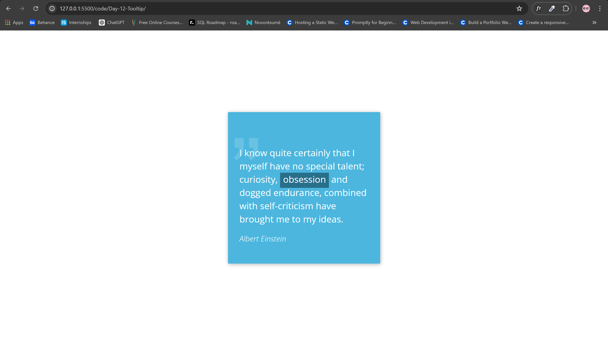

<h1>Tooltip Challenge</h1>

<h2>Description</h2>

<strong>Tooltip:</strong> I'm quite sure, you already know what obsession means. But you can look it up anyways.

This project is a part of a 100-day CSS challenge, focusing on creating a stylish and responsive tooltip using pure CSS. The tooltip provides additional information upon hover, featuring smooth transitions and a clean design.

<h2>Features</h2>
<ul>
    <li>Responsive quote display</li>
    <li>Tooltip with smooth transitions</li>
    <li>Clean and modern design</li>
    <li>Pure CSS implementation</li>
</ul>

<h2>Inspiration</h2>

Credits for the original design and inspiration go to <a href="https://100dayscss.com/days/12/" target="_blank">100 Days CSS - Day 12</a>.

<h2>Repository</h2>

You can find the project repository on GitHub: <a href="https://github.com/Yashi-Singh-1/Day-12-Tooltip" target="_blank">Day-12-Tooltip</a>

<h2>Installation</h2>

To get a local copy up and running, follow these simple steps:

<ol>
    <li><strong>Clone the repo</strong></li>
    <pre><code>git clone https://github.com/Yashi-Singh-1/Day-12-Tooltip.git</code></pre>
    <li><strong>Open the project folder</strong></li>
    <pre><code>cd Day-12-Tooltip</code></pre>
    <li><strong>Open <code>index.html</code> in your browser</strong></li>
    <pre><code>open index.html</code></pre>
</ol>

<h2>Preview</h2>

<h2>Project Structure</h2>
<pre>
<code>
Day-12-Tooltip/
├── styles.css
├── index.html
└── README.md
</code>
</pre>

<h2>Contribution</h2>

Contributions are what make the open source community such an amazing place to learn, inspire, and create. Any contributions you make are <strong>greatly appreciated</strong>.

<ol>
    <li>Fork the Project</li>
    <li>Create your Feature Branch (<code>git checkout -b feature/AmazingFeature</code>)</li>
    <li>Commit your Changes (<code>git commit -m 'Add some AmazingFeature'</code>)</li>
    <li>Push to the Branch (<code>git push origin feature/AmazingFeature</code>)</li>
    <li>Open a Pull Request</li>
</ol>

<h2>Credits</h2>

This project was inspired by <a href="https://100dayscss.com/days/12/" target="_blank">100 Days CSS - Day 12</a>. Special thanks to the creators of this challenge for providing such an engaging and educational project.

